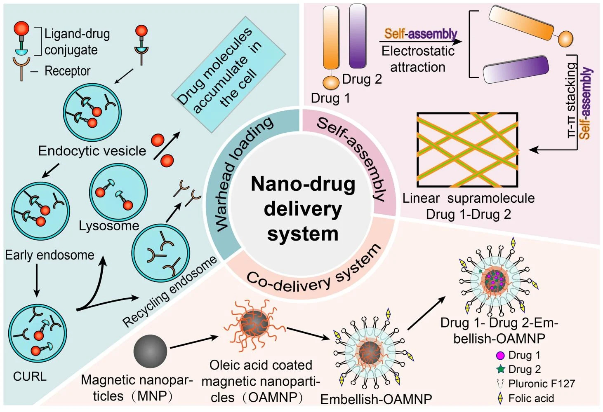
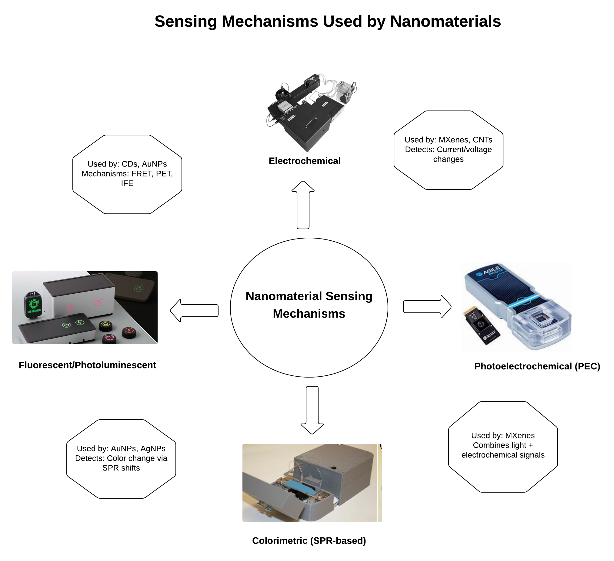
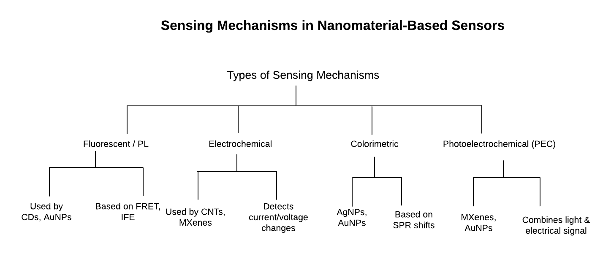
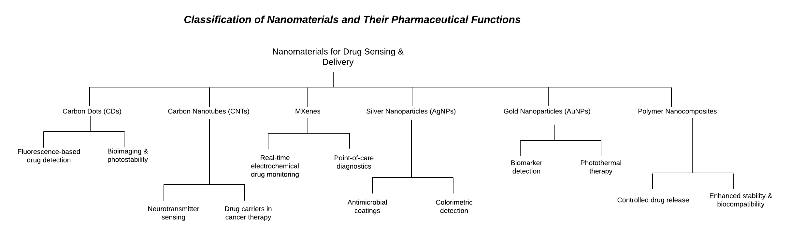
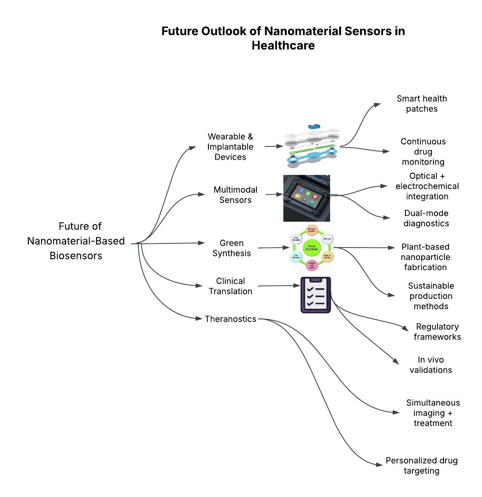
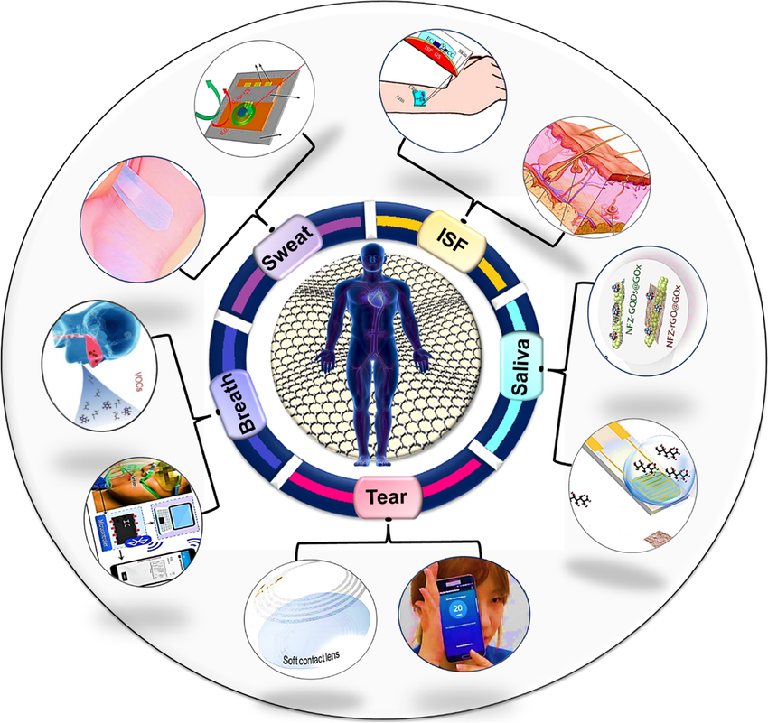
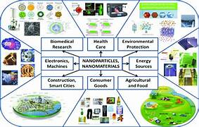
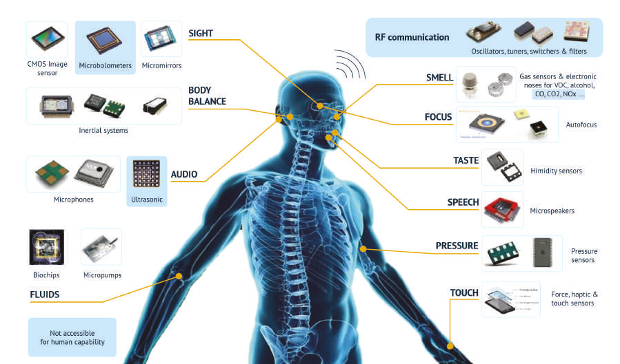
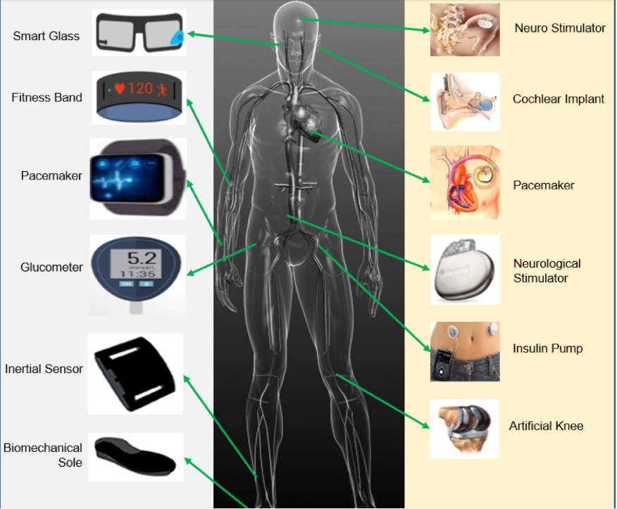

# nanomaterial-sensors-review
Review Article on **Nanomaterial-Based Sensors for Biomedical and Pharmaceutical Applications**.
This repository contains:
- The main review article PDF
- Infographics summarizing key concepts
📄 **[Download Full Review Article (PDF)](project%20-%20nanomaterial%20-based%20sensors.pdf)**  
*(Click the link above to read the full article)*
## Overview
This repository hosts the review article titled:
**"Revolutionizing Pharmacy: The Role of Nanomaterial-Based Sensors"**
This article presents an in-depth overview of how nanomaterial-based sensors are transforming biomedical and pharmaceutical sectors. It covers sensor types, fabrication, mechanisms of detection, and current applications in healthcare and diagnostics.
##  Key Highlights
- Types and classifications of nanosensors
- Sensing mechanisms: electrochemical, optical, piezoelectric, etc.
- Role of nanomaterials in enhancing sensitivity and specificity
- Biomedical and pharmaceutical applications
- Challenges, limitations, and future research directions
## 📊 Infographics — Nanosensor Project
Below are visual summaries from the Nanomaterial-Based Sensors Review Project.
### 1. Targeted Drug Delivery Using Functionalized Nanocarriers

### 2. Sensing Mechanisms Used by Nanomaterials

### 3. Types of Sensing Mechanisms

### 4. Classification of Nanomaterial and Pharmaceutical Functions

### 5. Future Outlook of Nanomaterial Sensors in Healthcare

### 6. Graphene-Based Wearable Biosensors

### 7. Nanoparticle and Nanomaterial Applications

### 8. Real World Sensors

### 9. Wearable Biosensors Applications

## Author
**Hymavathi Musidipalli**  
*M.Tech Nanotechnology | B.Pharm | Independent Researcher*
##  Keywords
`Nanomaterials` • `Nanosensors` • `Pharmaceutical Technology` • `Biomedical Applications` • `Diagnostics` • `Review Article`
##  Citation
This review article is self-published and available on GitHub for academic and research reference. You may cite it using the following formats:
**APA (7th Edition)**  
Musidipalli, H. (2025). *Revolutionizing pharmacy: The role of nanomaterial-based sensors*. GitHub. https://github.com/Hyma10/nanomaterial-sensors-review
**MLA (9th Edition)**  
Musidipalli, Hymavathi. *Revolutionizing Pharmacy: The Role of Nanomaterial-Based Sensors*. GitHub, 2025, https://github.com/Hyma10/nanomaterial-sensors-review.
**IEEE**  
H. Musidipalli, "Revolutionizing Pharmacy: The Role of Nanomaterial-Based Sensors," GitHub, 2025. [Online]. Available: https://github.com/Hyma10/nanomaterial-sensors-review
If you use this repository, please cite:
> Hymavathi Musidipalli. *Nanomaterial-Based Sensors for Biomedical and Pharmaceutical Applications*. GitHub. Available at: [https://github.com/Hyma10/nanomaterial-sensors-review](https://github.com/Hyma10/nanomaterial-sensors-review)
##  How to Use
- Explore the PDF for full review details.
- Use the infographics for quick understanding and presentations.
- Click the **Download PDF** link above to read the article.
- Use the citation section to reference this article in your own work.
- Feel free to fork or clone the repository for academic sharing or discussion.
##  Future Scope
This review lays the groundwork for future exploration in:
- Real-time point-of-care nanobiosensors
- Integration of nanomaterials with AI/IoT for diagnostics
- Commercialization strategies for pharma-based nanosensors
- Overcoming bioavailability and specificity challenges in nanosensor development
##  Contributions
If you'd like to contribute corrections, enhancements, or new sections (e.g., figures, references, or case studies), feel free to:
- Fork this repository
- Create a new branch
- Submit a pull request
##  Connect with Me
I'm open to research discussion, science communication, and knowledge sharing.
- 🌐 LinkedIn: [Hymavathi Musidipalli](https://www.linkedin.com/in/musidipallihymavathi/)
- 📝 Blog: [Medium – Hymavathi Musidipalli](https://medium.com/@hymavathimusidipalli)
## Support
If you found this work helpful:
- Star ⭐ this repo
- Share it on LinkedIn or academic groups
- Reference it in your own work or projects
Let’s grow open-source science together! 
